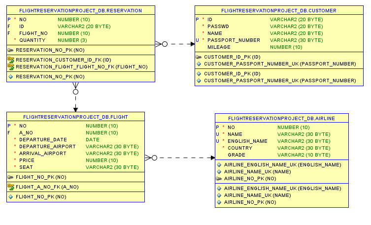
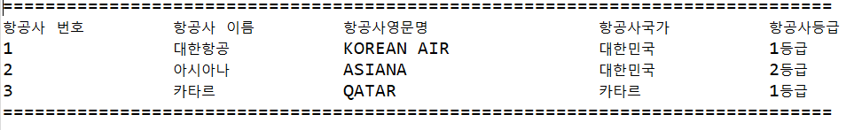
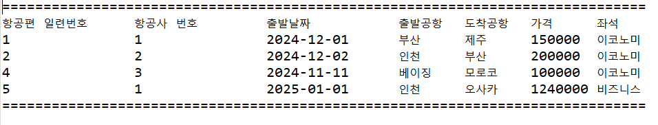
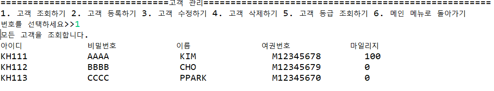
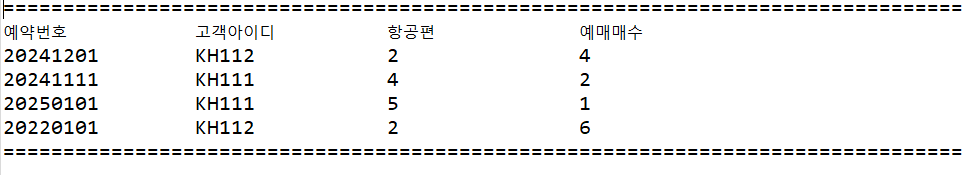

# ✈️Project-Flight-Reservation
자바 + Oracle SQL 비행기 예약 관리 프로그램


## 🖥️ 프로젝트 소개
비행기 예약,비행편,항송사,고객을 관리하는 프로그램입니다
<br>

## 🕰️ 개발 기간
24.11.28일 - 24.12.02일

### ⚙️ 개발 환경
- JDK 21.0.4
- SQL*Plus : 21.3.0.0.0
- Oracle SQL Developer : 24.3.0.284
- Eclipse : 2024-06 (4.32.0)


🟨 ERD





📌 주요 기능
#### ✔️ 항공사정보 
- 데이터 정렬, 수정, 입력 ,삭제 기능
- DB와 자바 데이터 연동
- 삭제시 자동 백업하는 테이블 생성
- 항공사 이름과 등급을 출력하는 펑션 생성

📷항공사 정보 출력 화면



🤔 내가 알고 싶은 공항은 어떻게 알까?

A: 그러한 문제를 해결하고자 항공사 이름을 검색하면 항공사의 국가와 번호가 나오게 함수를 만듬

```
CREATE OR REPLACE FUNCTION AIRLINE_GRADE_FUNC(VNAME IN AIRLINE.NAME%TYPE)RETURN VARCHAR2
IS
    VNO NUMBER(10);
    VGRADE VARCHAR2(10);
    VMESSAGE VARCHAR2(200);
BEGIN
    SELECT NO,GRADE INTO VNO, VGRADE FROM AIRLINE WHERE NAME = VNAME;
    VMESSAGE := '항공사 번호는 '||VNO||'이고 항공사등급은 '||VGRADE||'입니다.';
    RETURN VMESSAGE;
END;
/
```
___

#### ✔️ 항공편정보
- 데이터 정렬, 수정, 입력 ,삭제 기능
- DB와 자바 데이터 연동
- 삭제시 자동 백업하는 테이블 생성
- 입력한 항공사정보에 따라 금액을 인상하는 프로시저 생성

📷항공편 정보 출력 화면


🤔 티켓의 가격을 올리고 싶을때 어떻게 할까?

A: 항공사의 번호를 입력하면 가격을 10% 인상할 수 있는 프로시져를 만듬
```
CREATE OR REPLACE PROCEDURE FLIGHT_PRICE_PROC(VANO IN FLIGHT.A_NO%TYPE)
IS
BEGIN
    UPDATE FLIGHT SET PRICE = PRICE * 1.1 WHERE A_NO = VANO;
END;
/
```
___

#### ✔️ 고객정보 
- 데이터 정렬, 수정, 입력 ,삭제 기능
- DB와 자바 데이터 연동
- 삭제시 자동 백업하는 테이블 생성
- 마일리지에 따라 고객정보를 출력하는 펑션 생성

📷고객 정보 출력 화면


🤔 나의 마일리지 등급은 뭘까?

A: 마일리지가 일정금액 초과시 등급 상승하는 함수를 만듬
```
CREATE OR REPLACE FUNCTION CUSTOMER_GRADE_FUNC(VID IN CUSTOMER.ID%TYPE) RETURN VARCHAR2
IS
    VMESSAGE VARCHAR2(100);
    CUSTOMER_RT CUSTOMER%ROWTYPE;
BEGIN
    SELECT * INTO CUSTOMER_RT FROM CUSTOMER WHERE ID = VID;
    IF(CUSTOMER_RT.MILEAGE <= 1000) THEN
    VMESSAGE := CUSTOMER_RT.NAME||' 고객님은 실버등급입니다.';
    ELSIF(CUSTOMER_RT.MILEAGE <= 5000) THEN
    VMESSAGE := CUSTOMER_RT.NAME||' 고객님은 골드등급입니다.';
    ELSIF(CUSTOMER_RT.MILEAGE <= 10000) THEN
    VMESSAGE := CUSTOMER_RT.NAME||' 고객님은 플래티넘등급입니다.';
    ELSE
    VMESSAGE := CUSTOMER_RT.NAME||' 고객님은 다이아등급입니다.';
    END IF;
    RETURN VMESSAGE;
END;
/
```
___

#### ✔️ 예약정보
- 데이터 정렬, 수정, 입력 ,삭제 기능
- DB와 자바 데이터 연동
- 삭제시 자동 백업하는 테이블 생성
- 테이블들을 조인해서 출력
  
 📷고객 정보 출력 화면



🤔 예약하면 회원의 마일리지를 증가 시킬 수는 없을까?

A: 예약테이블에서 등록 시킬때 티켓하나당 마일리지 100을 증가시키는 트리거를 만듬
```
CREATE OR REPLACE TRIGGER UPDATE_CUSTOMER_MILEAGE_TRIGGER
AFTER INSERT OR UPDATE OF QUANTITY ON RESERVATION
FOR EACH ROW
WHEN (NEW.QUANTITY > NVL(OLD.QUANTITY, 0))
BEGIN
    UPDATE CUSTOMER
    SET MILEAGE = MILEAGE + (:NEW.QUANTITY - NVL(:OLD.QUANTITY,0)) * 100
    WHERE ID = :NEW.ID;
END;
/
```
